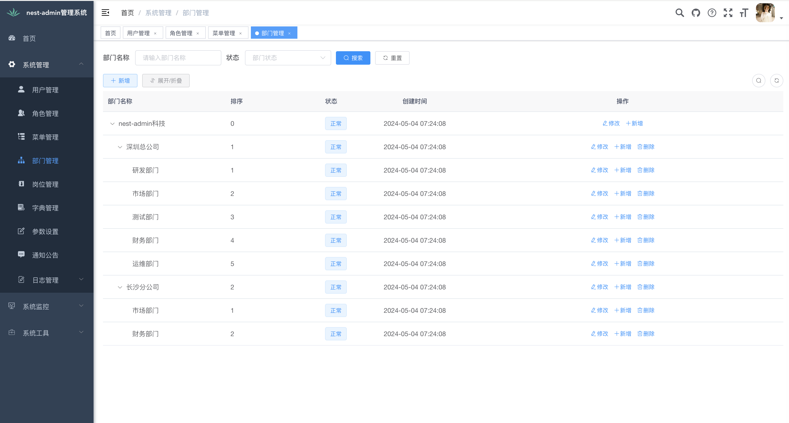

Language : [🇺🇸](./README.md) | 🇨🇳

<p align="center">
  <a href="https://nestjs.com">
    <picture>
      <source media="(prefers-color-scheme: dark)" srcset="https://nestjs.com/logo-small-gradient.76616405.svg">
      
    </picture>
    <h1 align="center">Nest-Admin</h1>
  </a>
</p>

<div align="center">

一款基于 Nestjs 最新版本的开箱即用的中后台管理系统.



</div>

- 预览: https://nest-admin.dooring.vip/
- 国内镜像: https://gitee.com/tao-zhi/nest-admin

## 1.0 版本! 🎉🎉🎉

Nest-Admin 1.0.0

## 内置功能

1.  用户管理：用户是系统操作者，该功能主要完成系统用户配置。
2.  部门管理：配置系统组织机构（公司、部门、小组），树结构展现支持数据权限。
3.  岗位管理：配置系统用户所属担任职务。
4.  菜单管理：配置系统菜单，操作权限，按钮权限标识等。
5.  角色管理：角色菜单权限分配、设置角色按机构进行数据范围权限划分。
6.  字典管理：对系统中经常使用的一些较为固定的数据进行维护。
7.  参数管理：对系统动态配置常用参数。
8.  通知公告：系统通知公告信息发布维护。
9.  操作日志：系统正常操作日志记录和查询；系统异常信息日志记录和查询。
10. 登录日志：系统登录日志记录查询包含登录异常。
11. 在线用户：当前系统中活跃用户状态监控。
12. 定时任务：在线（添加、修改、删除)任务调度包含执行结果日志。
13. 代码生成：前后端代码的生成（node、html、sql）支持 CRUD 下载 。
14. 系统接口：根据业务代码自动生成相关的 api 接口文档。
15. 服务监控：监视当前系统 CPU、内存、磁盘、堆栈等相关信息。
16. 缓存监控：对系统的缓存查询，删除、清空等操作。
17. 在线构建器：拖动表单元素生成相应的 HTML 代码。
18. 连接池监视：监视当前系统数据库连接池状态，可进行分析 SQL 找出系统性能瓶颈。

## 使用

### 安装

```shell
$ git clone git@github.com:taozhi1010/nest-admin.git
```

安装依赖:

```shell
$ cd nest-admin && yarn
```

## 浏览器支持

现代浏览器.

| [](http://godban.github.io/browsers-support-badges/)</br>Edge | [](http://godban.github.io/browsers-support-badges/)</br>Firefox | [](http://godban.github.io/browsers-support-badges/)</br>Chrome | [](http://godban.github.io/browsers-support-badges/)</br>Safari | [](http://godban.github.io/browsers-support-badges/)</br>Opera |
| ----------------------------------------------------------------------------------------------------------------------------------------------------------------------------------------------------- | ----------------------------------------------------------------------------------------------------------------------------------------------------------------------------------------------------------------- | ------------------------------------------------------------------------------------------------------------------------------------------------------------------------------------------------------------- | ------------------------------------------------------------------------------------------------------------------------------------------------------------------------------------------------------------- | --------------------------------------------------------------------------------------------------------------------------------------------------------------------------------------------------------- |
| Edge                                                                                                                                                                                                  | last 2 versions                                                                                                                                                                                                   | last 2 versions                                                                                                                                                                                               | last 2 versions                                                                                                                                                                                               | last 2 versions                                                                                                                                                                                           |

## 更多优质项目

| 名称                                                                              | 描述                                                                                    |
| --------------------------------------------------------------------------------- | --------------------------------------------------------------------------------------- |
| [H5-Dooring](https://github.com/MrXujiang/h5-Dooring)                             | 让 H5 制作像搭积木一样简单, 轻松搭建 H5 页面, H5 网站, PC 端网站, LowCode 平台.         |
| [V6.Dooring](https://github.com/MrXujiang/v6.dooring.public)                      | 可视化大屏解决方案, 提供一套可视化编辑引擎, 助力个人或企业轻松定制自己的可视化大屏应用. |
| [dooring-electron-lowcode](https://github.com/MrXujiang/dooring-electron-lowcode) | 基于 electron 的 H5-Dooring 编辑器桌面端.                                               |
| [DooringX](https://github.com/H5-Dooring/dooringx)                                | 快速高效搭建可视化拖拽平台.                                                             |
| [Mitu](https://github.com/H5-Dooring/mitu-editor)                                 | 一款轻量级且可扩展的图片/图形编辑器解决方案.                                            |
| [xijs](https://github.com/MrXujiang/xijs)                                         | 一个开箱即用的面向业务的 javascript 工具库                                              |

## 贡献

欢迎对 nestjs 感兴趣的朋友一起共建:

- 提交 [issues](https://github.com/taozhi1010/nest-admin/issues) 来报告问题和优化建议.
- 主动 [pull requests](https://github.com/taozhi1010/nest-admin/pulls) 来优化代码.

## 联系

微信: `taozhi1010`

|                                 微信二维码                                 |
| :------------------------------------------------------------------------: |
|  |
