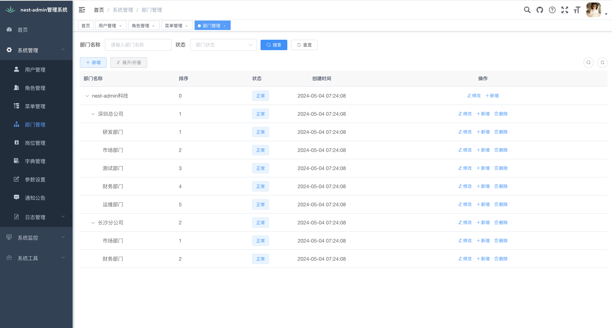

---
# https://vitepress.dev/reference/default-theme-home-page
layout: home

hero:
  name: "nest-admin"
  text: "企业级前后端分离管理系统"
  tagline: 基于 NestJS + Vue 3 构建，让开发与部署更简单高效
  actions:
    - theme: brand
      text: 前端指南
      link: /admin-guide
    - theme: alt
      text: 服务器端指南
      link: /server-guide
      
features:
  - title: 现代化技术栈
    details: 采用 NestJS + Vue 3 + TypeScript 构建，具备良好的可扩展性和类型安全
    link: /admin-guide#2-技术栈
  - title: 前后端分离架构
    details: 前端使用 Element Plus 组件库，后端采用模块化设计，便于团队协作开发
    link: /admin-guide#3-目录结构
  - title: 丰富的功能模块
    details: 包含用户管理、权限控制、系统配置等企业级管理系统必备功能
    link: /admin-guide#4-核心功能模块
  - title: 易于部署与维护
    details: 提供完整的部署文档和配置示例，支持多种部署方式
    link: /deploy-online/step
---

## 项目概述

nest-admin 是一款基于现代化技术栈构建的企业级前后端分离管理系统，旨在为开发者提供高效、安全、可扩展的应用开发解决方案。

### 快速访问

- **项目体验地址**：[https://nest-admin.dooring.vip/](https://nest-admin.dooring.vip/)
- **GitHub 源码地址**：[https://github.com/taozhi1010/nest-admin](https://github.com/taozhi1010/nest-admin)
- **Gitee 源码地址（国内镜像）**：[https://gitee.com/tao-zhi/nest-admin](https://gitee.com/tao-zhi/nest-admin)

### 项目定位

nest-admin 定位为企业级应用开发框架，适用于各类管理系统、后台系统的快速开发与构建。系统提供了完善的权限控制、用户管理、系统配置等基础功能模块，开发者可以在此基础上快速定制业务功能。

### 主要特点

1. **前后端分离架构**：前端基于 Vue 3 + Element Plus 构建，后端采用 NestJS 框架，数据交互通过 RESTful API 实现
2. **现代化技术栈**：全面使用 TypeScript 开发，提供类型安全保障，前端使用 Vite 构建工具提升开发效率
3. **完善的权限控制**：实现了基于 RBAC（基于角色的访问控制）的权限管理体系
4. **模块化设计**：前后端均采用模块化架构，便于功能扩展和代码维护
5. **丰富的功能组件**：集成了表单、表格、图表、富文本编辑器等常用组件，满足各类业务需求
6. **易于部署与维护**：支持 Docker 容器化部署，提供完整的部署文档和配置示例

### 技术栈概览

- **前端**：Vue 3、Element Plus、TypeScript、Vite、Pinia、Vue Router
- **后端**：NestJS、TypeScript、TypeORM、MySQL、Redis、JWT
- **开发工具**：ESLint、Prettier、Jest、Swagger

nest-admin 致力于降低企业级应用开发的门槛，提高开发效率，同时保证系统的安全性、稳定性和可扩展性。无论是快速构建小型管理系统，还是开发复杂的企业级应用，nest-admin 都能提供良好的支持。

